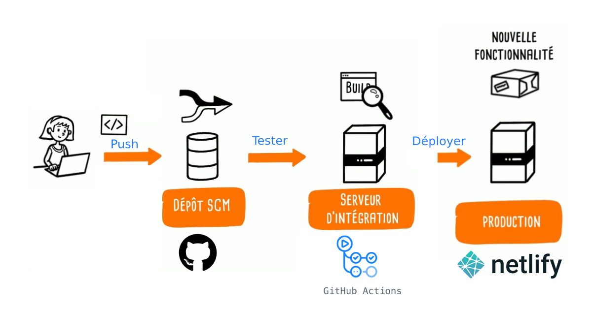
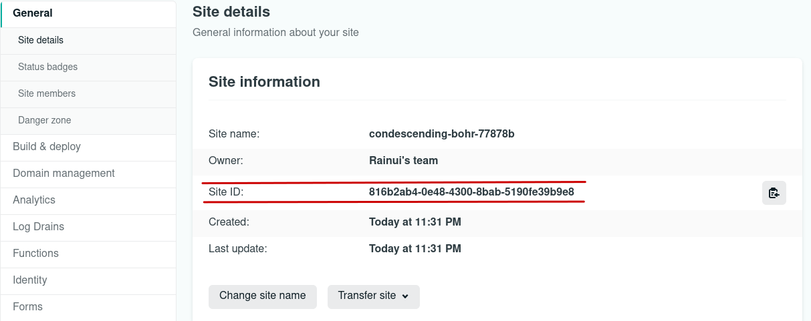

# IUT: Chaine CI/CD

@author Rxinui

## Atelier 0 : Hello World of CI/CD

### Pré-requis

Les technologies qui seront utilisées lors de cet atelier nécessitent :

Une installation de :

- [git](https://git-scm.com/downloads)

Un compte utilisateur sur :

- [Github (intégration)](https://github.com/login)
- [Netlify (déploiement)](https://app.netlify.com/)

### Introduction

Dans ce tutoriel, on va mettre en place **une chaîne CI/CD simplistique** avec pour seul intéret **la découverte des outils** et la mise en oeuvre des étapes CI/CD classique. De ce fait, cet atelier est concu pour **minimiser et simplifier** les taches de programmations. Les scripts d'automatisation systèmes (fichiers `.sh`) et code source vous sont fournis.

Une chaîne de CI/CD classique possède à minima deux étapes :

1. Build : initialisation de l'environnement de développement et test du code
2. Deploy : publication du code au sein d'un environment de production



Dans cet atelier, on ira au plus simple. On dispose d'un fichier `index.html` qui affiche le message `Hello World`.
On mettra en place une chaine dont la partie CI se chargera d'intégrer le changement de message, et la partie CD qui appliquera se changement sur l'environnement de production hébergé par Netlify

Note: on parle d'environnement de développement (localhost / machine) et de production (serveur public .ie Netlify dans cet atelier).

### GitHub Action : responsable de la chaine CI/CD

GitHub propose la création d'une chaine CI/CD avec sa solution maison nommée **GitHub Action**.
L'avantage de **GitHub Action** est qu'il s'applique sur les codes sources hébergés sur GitHub et offre au développeurs des modules de CI/CD appelées **Actions** disponible sur le [GitHub marketplace](https://github.com/marketplace?type=actions).

À la racine du projet, au sein d'un repo GitHub, un dossier `.github/workflows` doit être déclaré. Il contiendra la définition des chaînes CI/CD.
Chaque chaine CI/CD correspond à un fichier YAML. Dans cet atelier, notre chaine CI/CD est contenu dans le fichier `.github/workflows/main.yml`

GitHub Action utilise la syntaxe YAML (similaire au JSON) et suit les [propriétées énoncées dans la documentation officielle](https://docs.github.com/en/actions/using-workflows/workflow-syntax-for-github-actions).

Dans cet atelier, on épargnera plusieurs concepts et termes de GitHub Action. Je vous incite donc à lire le [guide officiel](https://docs.github.com/en/actions/learn-github-actions).

#### Code source

Le code source du projet se trouve dans le dossier `atelier`. On y retrouve :

- un fichier statique `atelier/index.html` qui affiche un simple `Hello World` dans une balise `<h1>`.
- un fichier de test `atelier/test.sh` qui vérifie que le contenue de la balise `<h1>` soit égale à la valeur stockée dans la variable shell `expected_result`.

Les objectifs de cet atelier sont :

- A. Construire une chaine CI/CD qui permet de build, tester et déployer.
- B. Mettre en avant l'exécution des étapes **tester** et **déployer**.
- C. Re-déclencher la chaine CI/CD à chaque nouveauté.

#### Partie CI

##### Indiquer quand déclencher le chaine CI/CD

Une chaine CI/CD sur GitHub Action se déclenche lorsqu'un **évenement GitHub survient sur le repo**. Dans notre cas, on souhaite que la chaine se lance lorsqu'un ou des commits sont `push` depuis votre branche locale `atl0_actif` vers cette même branche hébergé sur GitHub `origin/atl0_actif`.


**TODO**: modifier le fichier `.github/workflows/main.yml` pour déclencher la chaine CI/CD sur un push de votre branche. ([aide](https://docs.github.com/en/actions/using-workflows/triggering-a-workflow#using-events-to-trigger-workflows))

##### Donner les instructions de l'étape **test**

En local (uniquement Linux/MacOS), lancer le script de test présent dans `atelier/` comme ceci :

```bash
cd atelier/ && ./test.sh
```

Vous obtenez `Test h1 text: OK` qui indique que le contenu de la balise `<h1>` est bien `Hello World`.

À présent, il faut que ce fichier de test soit exécuter automatiquement par la chaine CI/CD, à l'étape de test.

**TODO**: modifier le fichier `.github/workflows/main.yml` à l'étape de test pour executer le script de test `atelier/test.sh`. ([aide](https://docs.github.com/en/actions/learn-github-actions/understanding-github-actions#understanding-the-workflow-file))

##### Tester la chaine CI

Maintenant que nos étapes `build` et `test` sont réalisées, il est intéressant de tester notre chaine. Pour cela, il faut enregistrer les ajouts effectués en créant un nouveau commit.

```bash
git commit -a -m "Complétion des étapes build et test."
```

On répercute les modifications faites sur la branche locale vers son homologue GitHub.

```bash
git push --set-upstream origin atl0_actif
```

La précédente commande a du être interprété par GitHub Action et déclencher la chaine CI/CD que nous avons créé. Se rendre sur la page web du repo GitHub et **cliquer sur l'onglet Actions**.

Cliquer sur le 1er item, correspondant au 1er déclenchement enregistré du au `push`.


Cliquer sur le bouton `build-test-deploy` pour afficher les détails de la chaine CI/CD.

#### Partie CD

Netlify est une solution gratuite qui permet d'héberger des sites statiques. On utilise l'Action qui permet de [déployer notre code source sur la plateforme Netlify](https://github.com/marketplace/actions/netlify-actions), qui nous sert d'environnement de production, c'est à dire, l'environnement public.

Avant d'automatiser le déploiement sur Netlify, il est nécessaire de le déployer une 1er fois manuellement afin d'enregistrer notre site sur Netlify.

##### Enregistrer notre projet sur Netlify

1. Se rendre sur [cette page](https://app.netlify.com/) et cliquer sur l'onglet **Site** puis **Import from Git**.
2. Cliquer sur le bouton de connexion **GitHub** et autoriser l'accès à votre repo.
3. Séléctionner le repo Github, cliquer une fois sur le bouton `Customize` puis remplissez les informations suivantes :

- **Branch to deploy**: `atl0_actif`
- **Base directory**: `atelier/`
- **Publish directory**: `atelier/`

4. Valider en cliquant sur le bouton **Deploy site**

Votre site sera deployé sous un nom de domaine personnalisé de la forme [https://<nom_aleatoire>.netlify.app](https://condescending-bohr-77878b.netlify.app). Cliquer dessus, et vous verrez un `Hello World` apparaitre!

Sur le panel Netlify, cliquer sur le bouton **Site settings** et garder sous la main la valeur `Site ID`.



Ensuite, sur son compte Netlify, se rendre dans les [paramètres d'application](https://app.netlify.com/user/applications) et créer un **New Access Token** qui nous permets d'utiliser l'API de Netlify depuis GitHub Action. Garder aussi sous la main **le secret généré**.


Se rendre sur votre repository GitHub, créer un nouveau secret `NETLIFY_AUTH_TOKEN` et coller le secret précédemment copié.
Faire de meme pour `NETLIFY_SITE_ID` et coller la valeur que vous avez copié de `SITE_ID`.


Enfin, remplacer l'étape existante de publication par le code ci-dessous, qui appelle à l'action `Netlify-actions`.

```yml
- name: "[CD] Publication du code"
  uses: nwtgck/actions-netlify@v1.2
  with:
    publish-dir: "./atelier"
    production-branch: atl0_actif
  env:
    NETLIFY_AUTH_TOKEN: ${{ secrets.NETLIFY_AUTH_TOKEN }}
    NETLIFY_SITE_ID: ${{ secrets.NETLIFY_SITE_ID }}
```

**Explication du code** : GitHub Actions nous sert de **serveur d'intégration**. Pour faciliter l'automatisation des tâches les plus connues et utilisées par les développeurs, la plateforme GitHub propose ce qu'elle appelle des **Actions** qui sont **plugins / extensions** qui facilitent l'écriture de la chaine CI/CD sur des étapes définies. Chaque utilisateur GitHub peut développer ses propres actions et ses actions seront accessible par tous.
Décortiquons le code ci-dessus :

- Le mot-clé `uses:` : indique que cette étape utilise une action (et non une commande shell). La valeur attendue correspond à URI de l'action.
- `nwtgck/actions-netlify@v1.2` : est l'action que nous utilisons. Elle facilite (_cache_) le déploiement sur Netlify. L'URI est décomposée comme-ceci :
  - `nwtgck/` : l'utilisateur GitHub qui met en service l'action
  - `actions-netlify` : le repository GitHub de l'utilisateur `nwtgck` où se trouve le code source de son action `actions-netlify`.
  - `@v1.2` : le tag de la version a utilisé. Une action peut avoir plusieurs versions (ie. `@v1`, `@beta-version`, ...)
- Le mot-clé `with:` : contient tous les paramètres de l'action utilisée (obligatoires et/ou optionnels) à définir.
  - `publish-dir:` est un paramètre attendu de l'action `actions-netlify` qui prendra comme valeur `"./atelier"` lorsque la chaine CI/CD s'exécutera.
- Le mot-clé `env:` : contient toutes les variables d'environnements et secrets qui sont attendus par l'action pour fonctionner.

Pour tester que le déploiement s'effectue automatiquement à chaque `push`, nous allons rajouter du texte dans notre fichier `atelier/index.html`
Remplacer les balises `<body>...</body>` par le contenu ci-dessous :

```html
<body>
  <h1 id="header-hello">Hello World</h1>
  <p id="mon-message">
    Je suis arrivé(e) à <strong>l'étape publication</strong> de
    <a href="https://github.com/Rxinui/iut-atelier-ci-cd/tree/atl0"
      >l'atelier 0</a
    >
    !
  </p>
</body>
```

Enregistrez les modifications par un nouveau commit et on répercute les modifications sur GitHub :

```bash
git commit -a -m "Ajout d'un message pour tester l'etape publication automatique";
git push
```

La chaine CI/CD a du être déclenchée à nouveau. Si le status de la chaine CI/CD est verte, alors votre site en production a du être mis-à-jour.

**TODO**: Vérifiez que votre site en production affiche les changements.

Nous considérons que notre chaine CI/CD est correcte et terminée ! Nous allons donc produire un cas d'erreur afin de planter notre chaine.

Modifier dans le fichier `atelier/index.html` la balise `<h1>...</h1>` par le code ci-dessous

```html
<h1 id="header-hello">Hello World of CI/CD</h1>
```

Enregistrez les modifications par un nouveau commit et on répercute les modifications sur GitHub :

```bash
git commit -a -m "Cas d'erreur sur notre chaine CI/CD (non résolu)";
git push
```

**TODO**: À quelle étape notre chaine CI/CD s'est plantée ? Pourquoi ? Notre site en production a-t-il été mis à jour ? Vérifiez.

**TODO**: Trouver ce qu'il faille faire pour que notre chaine CI/CD soit de nouveau acceptée, puis exécuter les commandes suivantes.

```bash
git commit -a -m "Cas d'erreur sur notre chaine CI/CD (résolu)";
git push
```

Puis vérifiez le site en production sur Netlify.

_That's all folks :)_
